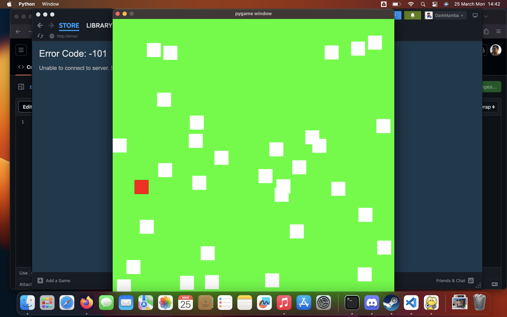

# Prey and Hunter Simulation

This is a simple simulation project implemented using Pygame, showcasing the relationship between prey and hunter entities based on their lifetimes and velocities.

## Installation
create virtual environment

    > python -m venv env
    > pip install -r requirements.txt

> python main.py

### Overview:

In this simulation, entities representing prey and hunters are placed in an environment where they interact based on certain rules. The main aspects of the simulation include:

* Prey: Entities with a limited lifetime and a random velocity. Prey move around the environment randomly and perish after a certain lifespan.After that if it collided with some other prey it will birth for next generation.

* Hunter: Entities with the objective of capturing prey. Hunters move towards prey within their vicinity and attempt to capture them. They 

* Interaction: When a hunter comes in contact with a prey, the prey is captured and removed from the simulation. The hunter's score increases upon successful capture.
